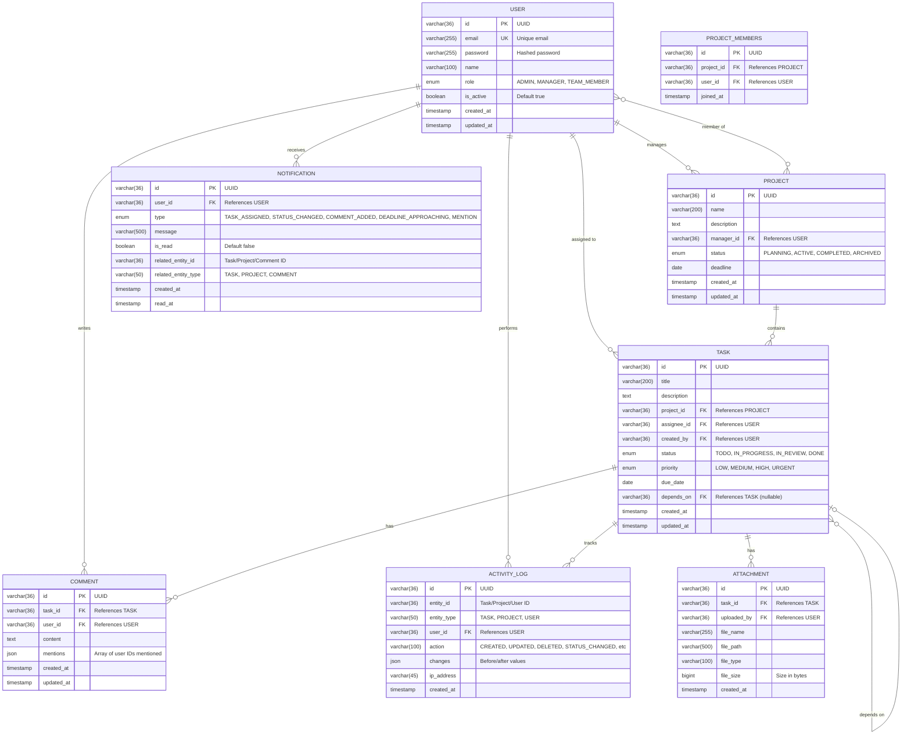

# ER Diagram

## Database Schema

This diagram shows the database tables and their relationships for the TaskFlow system.

## Diagram

## Tables

### USER Table
**Purpose**: Stores user account information and authentication details

| Column | Type | Constraints | Description |
|--------|------|-------------|-------------|
| id | VARCHAR(36) | PRIMARY KEY | UUID identifier |
| email | VARCHAR(255) | UNIQUE, NOT NULL | User's email address |
| password | VARCHAR(255) | NOT NULL | Bcrypt hashed password |
| name | VARCHAR(100) | NOT NULL | User's full name |
| role | ENUM | NOT NULL | ADMIN, MANAGER, TEAM_MEMBER |
| is_active | BOOLEAN | DEFAULT TRUE | Account status |
| created_at | TIMESTAMP | DEFAULT NOW() | Account creation time |
| updated_at | TIMESTAMP | DEFAULT NOW() | Last update time |

### PROJECT Table
**Purpose**: Stores project information and metadata

| Column | Type | Constraints | Description |
|--------|------|-------------|-------------|
| id | VARCHAR(36) | PRIMARY KEY | UUID identifier |
| name | VARCHAR(200) | NOT NULL | Project name |
| description | TEXT | NULL | Project description |
| manager_id | VARCHAR(36) | FOREIGN KEY | Project manager |
| status | ENUM | DEFAULT 'PLANNING' | Project status |
| deadline | DATE | NULL | Project deadline |
| created_at | TIMESTAMP | DEFAULT NOW() | Creation time |
| updated_at | TIMESTAMP | DEFAULT NOW() | Last update time |

### TASK Table
**Purpose**: Stores task details and assignments

| Column | Type | Constraints | Description |
|--------|------|-------------|-------------|
| id | VARCHAR(36) | PRIMARY KEY | UUID identifier |
| title | VARCHAR(200) | NOT NULL | Task title |
| description | TEXT | NULL | Detailed description |
| project_id | VARCHAR(36) | FOREIGN KEY | Parent project |
| assignee_id | VARCHAR(36) | FOREIGN KEY | Assigned user |
| created_by | VARCHAR(36) | FOREIGN KEY | Task creator |
| status | ENUM | DEFAULT 'TODO' | Current status |
| priority | ENUM | DEFAULT 'MEDIUM' | Task priority |
| due_date | DATE | NULL | Deadline |
| depends_on | VARCHAR(36) | FOREIGN KEY, NULL | Task dependency |
| created_at | TIMESTAMP | DEFAULT NOW() | Creation time |
| updated_at | TIMESTAMP | DEFAULT NOW() | Last update time |

## Relationships

### One-to-Many
- USER to TASK: One user can be assigned to many tasks
- USER to PROJECT: One user (manager) can manage many projects
- PROJECT to TASK: One project contains many tasks
- TASK to COMMENT: One task can have many comments

### Many-to-Many
- USER to PROJECT (through PROJECT_MEMBERS): Users can be members of multiple projects

### Self-Referencing
- TASK to TASK: Tasks can depend on other tasks

## Indexes

- user_email_idx on USER(email): Fast login lookups
- task_assignee_idx on TASK(assignee_id): Quick task queries
- task_project_idx on TASK(project_id): Fast project task retrieval
- notification_user_read_idx on NOTIFICATION(user_id, is_read): Unread notifications

## Constraints

### Foreign Keys
- PROJECT.manager_id references USER.id ON DELETE SET NULL
- TASK.project_id references PROJECT.id ON DELETE CASCADE
- TASK.assignee_id references USER.id ON DELETE SET NULL
- COMMENT.task_id references TASK.id ON DELETE CASCADE
- NOTIFICATION.user_id references USER.id ON DELETE CASCADE

### Unique Constraints
- USER.email: Each email must be unique
- PROJECT_MEMBERS(project_id, user_id): User can't be added to same project twice
