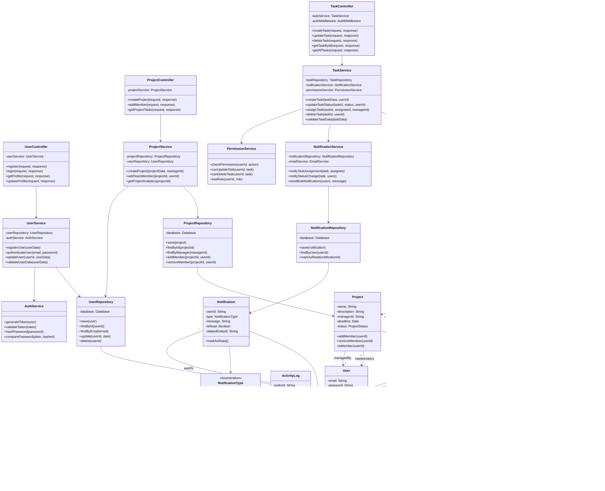

# Class Diagram

## Overview
This diagram shows the major classes and their relationships in the TaskFlow system, following a layered architecture with clear separation of concerns.

## Diagram

## Class Descriptions

### Controller Layer
**Purpose**: Handle HTTP requests, validate input, and send responses

**Key Classes**:
- `TaskController`: Manages task-related endpoints (CRUD operations)
- `UserController`: Handles authentication and user management
- `ProjectController`: Manages project operations and team assignments

### Service Layer
**Purpose**: Implement business logic and orchestrate operations

**Key Classes**:
- `TaskService`: Core task management logic, validation, and workflow
- `UserService`: User registration, authentication, profile management
- `ProjectService`: Project creation, team management, analytics
- `NotificationService`: Handles all notification logic (email, in-app)
- `PermissionService`: Centralized authorization and permission checks
- `AuthService`: JWT token generation and validation, password hashing

### Repository Layer
**Purpose**: Handle data access and database operations

**Key Classes**:
- `TaskRepository`: CRUD operations for tasks, activity logging
- `UserRepository`: User data persistence and retrieval
- `ProjectRepository`: Project data management
- `NotificationRepository`: Notification storage and retrieval

### Model/Entity Layer
**Purpose**: Represent domain objects and business entities

**Key Classes**:
- `BaseEntity`: Abstract base class with common fields (id, timestamps)
- `User`: Represents system users with roles and permissions
- `Task`: Core entity representing a task with status and priority
- `Project`: Represents a project containing multiple tasks
- `Comment`: Task comments for collaboration
- `Notification`: System notifications for users
- `ActivityLog`: Audit trail for all system actions

## OOP Principles Applied

### Encapsulation
- All entity fields are private with controlled access through methods
- Repository classes encapsulate database access logic
- Service classes hide business logic complexity from controllers
- Password hashing is encapsulated in AuthService

### Abstraction
- `BaseEntity` provides abstract interface for all domain models
- Repository pattern abstracts database operations
- Service layer abstracts business logic from controllers
- Interface-based design allows easy testing and mocking

### Inheritance
- All entities extend `BaseEntity` to inherit common fields and methods
- Role hierarchy: Admin inherits Manager capabilities, Manager inherits Team Member capabilities
- Exception hierarchy for custom error handling

### Polymorphism
- Different notification types handled through `NotificationType` enum
- Task status transitions handled polymorphically
- Repository methods work with BaseEntity type
- Different user roles have different permission implementations

## Design Patterns

### Pattern 1: Repository Pattern
- **Where**: TaskRepository, UserRepository, ProjectRepository
- **Why**: Separates data access logic from business logic, makes testing easier, allows switching databases without changing business code

### Pattern 2: Service Layer Pattern
- **Where**: TaskService, UserService, ProjectService
- **Why**: Centralizes business logic, promotes reusability, maintains single responsibility principle

### Pattern 3: Strategy Pattern
- **Where**: PermissionService with different permission strategies for roles
- **Why**: Allows dynamic permission checking based on user role without complex conditionals

### Pattern 4: Observer Pattern
- **Where**: NotificationService observing task status changes
- **Why**: Decouples notification logic from task operations, allows multiple observers for same event

### Pattern 5: Factory Pattern
- **Where**: Creating different types of notifications based on NotificationType
- **Why**: Centralizes object creation logic, makes adding new notification types easier

### Pattern 6: Singleton Pattern
- **Where**: Database connection pool, AuthService
- **Why**: Ensures single instance for shared resources, prevents multiple connections

### Pattern 7: Dependency Injection
- **Where**: All service and repository dependencies injected through constructors
- **Why**: Promotes loose coupling, makes testing easier, improves maintainability
