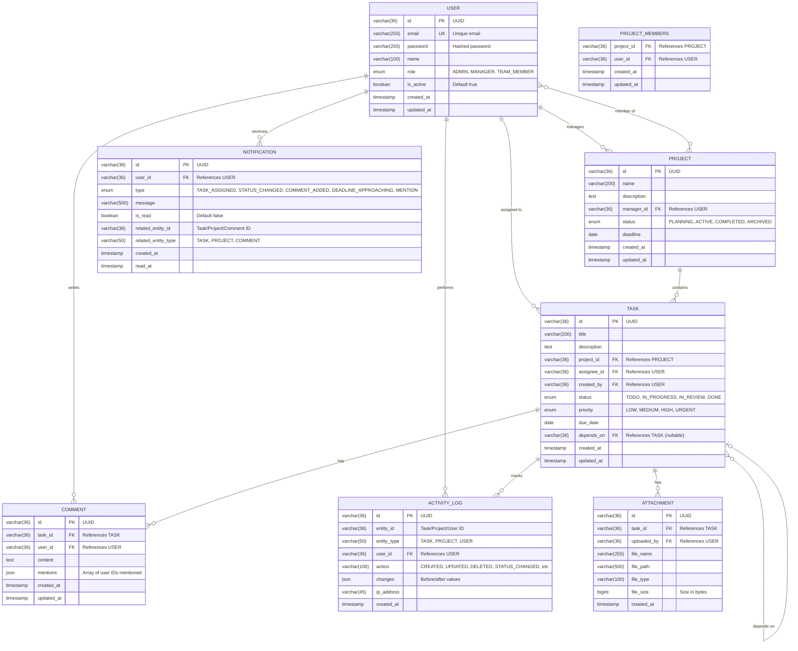

# ER Diagram

## Database Schema

This diagram shows the database tables and their relationships for the TaskFlow system.

## Diagram

## Tables

### USER Table
Purpose: Stores user account information and authentication details

| Column | Type | Constraints | Description |
|--------|------|-------------|-------------|
| id | VARCHAR(36) | PRIMARY KEY | UUID identifier |
| email | VARCHAR(255) | UNIQUE, NOT NULL | User's email address |
| password | VARCHAR(255) | NOT NULL | Bcrypt hashed password |
| name | VARCHAR(100) | NOT NULL | User's full name |
| role | ENUM | NOT NULL | ADMIN, MANAGER, TEAM_MEMBER |
| isActive | BOOLEAN | DEFAULT TRUE | Account status |
| createdAt | TIMESTAMP | DEFAULT NOW() | Account creation time |
| updatedAt | TIMESTAMP | DEFAULT NOW() | Last update time |

### PROJECT Table
Purpose: Stores project information and metadata

| Column | Type | Constraints | Description |
|--------|------|-------------|-------------|
| id | VARCHAR(36) | PRIMARY KEY | UUID identifier |
| name | VARCHAR(200) | NOT NULL | Project name |
| description | TEXT | NULL | Project description |
| managerId | VARCHAR(36) | FOREIGN KEY | Project manager |
| status | ENUM | DEFAULT 'PLANNING' | Project status |
| deadline | DATE | NULL | Project deadline |
| createdAt | TIMESTAMP | DEFAULT NOW() | Creation time |
| updatedAt | TIMESTAMP | DEFAULT NOW() | Last update time |

### PROJECT_MEMBERS Table
Purpose: Maps users to projects (many-to-many relationship)

| Column | Type | Constraints | Description |
|--------|------|-------------|-------------|
| projectId | VARCHAR(36) | FOREIGN KEY, PRIMARY KEY | Project reference |
| userId | VARCHAR(36) | FOREIGN KEY, PRIMARY KEY | User reference |
| createdAt | TIMESTAMP | DEFAULT NOW() | Join time |
| updatedAt | TIMESTAMP | DEFAULT NOW() | Last update time |

### TASK Table
Purpose: Stores task details and assignments

| Column | Type | Constraints | Description |
|--------|------|-------------|-------------|
| id | VARCHAR(36) | PRIMARY KEY | UUID identifier |
| title | VARCHAR(200) | NOT NULL | Task title |
| description | TEXT | NULL | Detailed description |
| projectId | VARCHAR(36) | FOREIGN KEY | Parent project |
| assigneeId | VARCHAR(36) | FOREIGN KEY | Assigned user |
| createdBy | VARCHAR(36) | FOREIGN KEY | Task creator |
| status | ENUM | DEFAULT 'TODO' | Current status |
| priority | ENUM | DEFAULT 'MEDIUM' | Task priority |
| dueDate | DATE | NULL | Deadline |
| dependsOn | VARCHAR(36) | FOREIGN KEY, NULL | Task dependency |
| createdAt | TIMESTAMP | DEFAULT NOW() | Creation time |
| updatedAt | TIMESTAMP | DEFAULT NOW() | Last update time |

### COMMENT Table
Purpose: Stores task comments and discussions

| Column | Type | Constraints | Description |
|--------|------|-------------|-------------|
| id | VARCHAR(36) | PRIMARY KEY | UUID identifier |
| taskId | VARCHAR(36) | FOREIGN KEY | Parent task |
| userId | VARCHAR(36) | FOREIGN KEY | Comment author |
| content | TEXT | NOT NULL | Comment text |
| mentions | JSON | NULL | Mentioned user IDs |
| createdAt | TIMESTAMP | DEFAULT NOW() | Creation time |
| updatedAt | TIMESTAMP | DEFAULT NOW() | Last update time |

### ATTACHMENT Table
Purpose: Stores file attachments for tasks

| Column | Type | Constraints | Description |
|--------|------|-------------|-------------|
| id | VARCHAR(36) | PRIMARY KEY | UUID identifier |
| taskId | VARCHAR(36) | FOREIGN KEY | Parent task |
| uploadedBy | VARCHAR(36) | FOREIGN KEY | Uploader user |
| fileName | VARCHAR(255) | NOT NULL | Original file name |
| filePath | VARCHAR(500) | NOT NULL | Storage path |
| fileType | VARCHAR(100) | NOT NULL | MIME type |
| fileSize | BIGINT | NOT NULL | Size in bytes |
| createdAt | TIMESTAMP | DEFAULT NOW() | Upload time |

### NOTIFICATION Table
Purpose: Stores user notifications

| Column | Type | Constraints | Description |
|--------|------|-------------|-------------|
| id | VARCHAR(36) | PRIMARY KEY | UUID identifier |
| userId | VARCHAR(36) | FOREIGN KEY | Recipient user |
| type | ENUM | NOT NULL | Notification type |
| message | VARCHAR(500) | NOT NULL | Notification message |
| isRead | BOOLEAN | DEFAULT FALSE | Read status |
| relatedEntityId | VARCHAR(36) | NULL | Related entity ID |
| relatedEntityType | VARCHAR(50) | NULL | Entity type (TASK, PROJECT, COMMENT) |
| createdAt | TIMESTAMP | DEFAULT NOW() | Creation time |
| readAt | TIMESTAMP | NULL | Read timestamp |

### ACTIVITY_LOG Table
Purpose: Stores audit trail of all system changes

| Column | Type | Constraints | Description |
|--------|------|-------------|-------------|
| id | VARCHAR(36) | PRIMARY KEY | UUID identifier |
| entityId | VARCHAR(36) | NOT NULL | Entity being modified |
| entityType | VARCHAR(50) | NOT NULL | Type of entity |
| userId | VARCHAR(36) | FOREIGN KEY | User performing action |
| action | VARCHAR(100) | NOT NULL | Action performed |
| changes | JSON | NULL | Before/after values |
| ipAddress | VARCHAR(45) | NULL | IP address of requester |
| createdAt | TIMESTAMP | DEFAULT NOW() | Action time |

## Relationships

### One-to-Many
- USER to TASK: One user can be assigned to many tasks
- USER to PROJECT: One user (manager) can manage many projects
- USER to COMMENT: One user can write many comments
- PROJECT to TASK: One project contains many tasks
- TASK to COMMENT: One task can have many comments
- TASK to ATTACHMENT: One task can have many attachments

### Many-to-Many
- USER to PROJECT (through PROJECT_MEMBERS): Users can be members of multiple projects

### Self-Referencing
- TASK to TASK: Tasks can depend on other tasks

## Indexes

- user_email_idx on USER(email): Fast login lookups
- task_assignee_idx on TASK(assigneeId): Quick task queries
- task_project_idx on TASK(projectId): Fast project task retrieval
- task_status_idx on TASK(status): Filter by status
- notification_user_read_idx on NOTIFICATION(userId, isRead): Unread notifications
- comment_task_idx on COMMENT(taskId): Get task comments
- activity_log_entity_idx on ACTIVITY_LOG(entityId, entityType): Audit trail queries

## Constraints

### Foreign Keys
- PROJECT.managerId references USER.id ON DELETE SET NULL
- TASK.projectId references PROJECT.id ON DELETE CASCADE
- TASK.assigneeId references USER.id ON DELETE SET NULL
- TASK.createdBy references USER.id ON DELETE SET NULL
- COMMENT.taskId references TASK.id ON DELETE CASCADE
- COMMENT.userId references USER.id ON DELETE SET NULL
- ATTACHMENT.taskId references TASK.id ON DELETE CASCADE
- ATTACHMENT.uploadedBy references USER.id ON DELETE SET NULL
- NOTIFICATION.userId references USER.id ON DELETE CASCADE
- ACTIVITY_LOG.userId references USER.id ON DELETE SET NULL

### Unique Constraints
- USER.email: Each email must be unique
- PROJECT_MEMBERS(projectId, userId): User can't be added to same project twice

## Data Types

### Enums
- USER.role: ADMIN, MANAGER, TEAM_MEMBER
- PROJECT.status: PLANNING, ACTIVE, COMPLETED, ARCHIVED
- TASK.status: TODO, IN_PROGRESS, IN_REVIEW, DONE
- TASK.priority: LOW, MEDIUM, HIGH, URGENT
- NOTIFICATION.type: TASK_ASSIGNED, STATUS_CHANGED, COMMENT_ADDED, DEADLINE_APPROACHING, MENTION

## Scalability Considerations

- UUID primary keys for distributed systems
- Proper indexing for frequently queried columns
- Cascade delete for maintaining referential integrity
- JSON columns for flexible data storage
- Timestamp tracking for audit purposes
- Activity logs for complete audit trail
