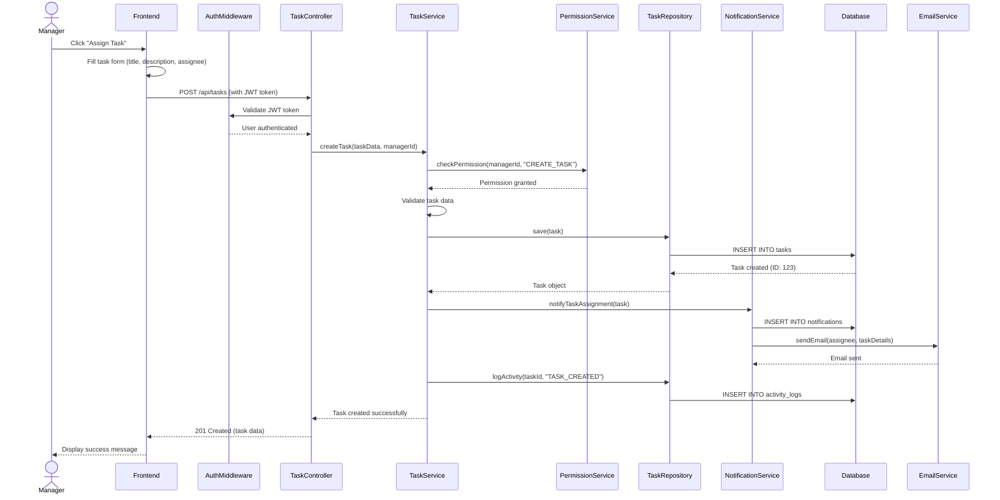
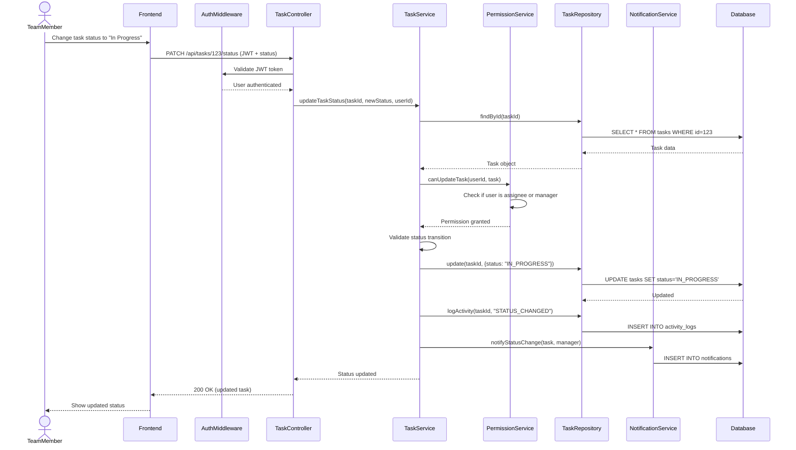
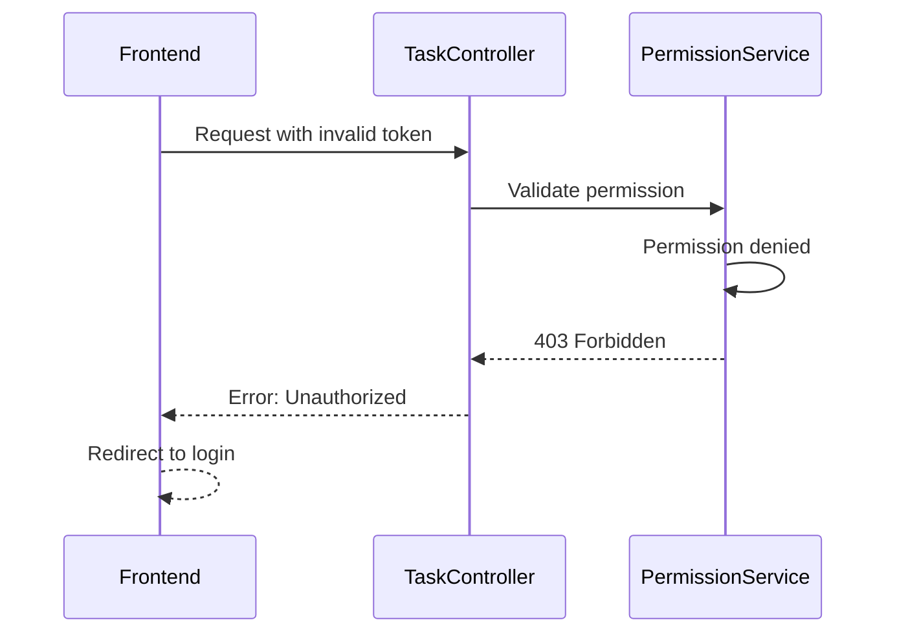
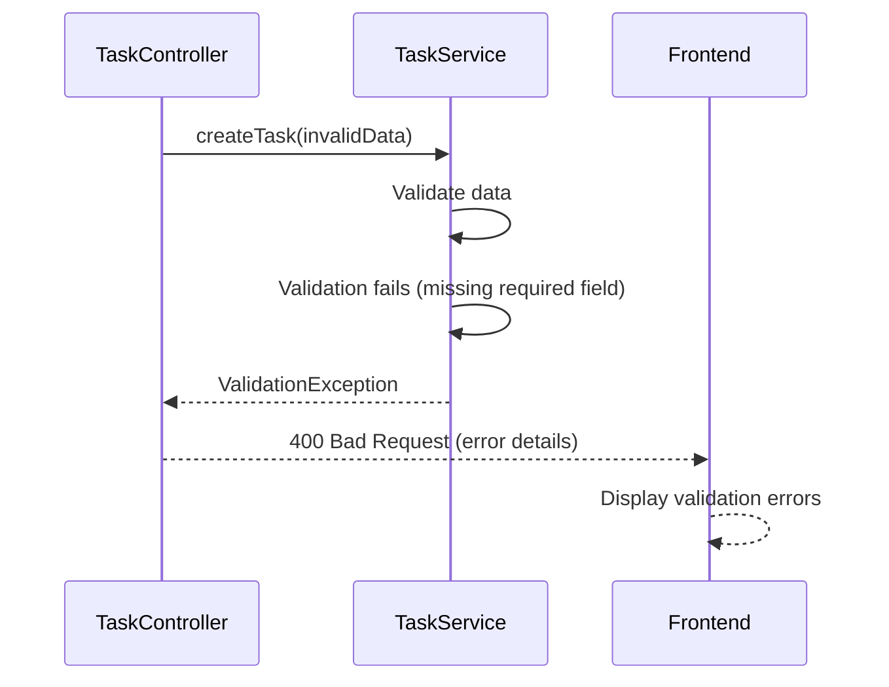
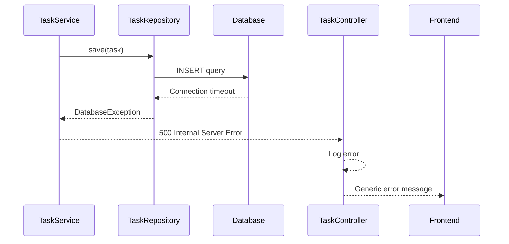

# Sequence Diagram

## Main Flow: Task Assignment and Status Update

This diagram shows the end-to-end flow when a manager assigns a task to a team member and the team member updates its status.

## Diagram - Task Assignment Flow

## Diagram - Task Status Update Flow

## Flow Description

### Task Assignment Flow

#### Step 1: Manager Initiates Task Creation
Manager fills out a form with task details including title, description, priority, deadline, and selects a team member to assign.

#### Step 2: Frontend Processing
Frontend validates form data, attaches JWT token from localStorage, and sends POST request to backend API.

#### Step 3: Authentication Middleware
AuthMiddleware intercepts the request, validates JWT token, extracts user information, and attaches it to the request object.

#### Step 4: Controller Layer
TaskController receives the request, extracts task data and user info, and delegates to TaskService for business logic processing.

#### Step 5: Permission Validation
PermissionService checks if the user has the required role (Manager or Admin) to create and assign tasks.

#### Step 6: Service Layer - Business Logic
TaskService validates task data (required fields, valid dates, assignee exists), applies business rules, and prepares data for persistence.

#### Step 7: Repository Layer - Data Persistence
TaskRepository uses ORM to insert task data into the database, handling the SQL query generation and execution.

#### Step 8: Notification System
NotificationService creates a notification record and triggers EmailService to send an email to the assigned team member.

#### Step 9: Activity Logging
System logs the task creation activity with timestamp, user, and action details for audit trail.

#### Step 10: Response Flow
Success response travels back through the layers, and frontend displays confirmation to the manager.

### Task Status Update Flow

#### Step 1: Team Member Updates Status
Team member clicks on status dropdown and selects new status (To Do → In Progress → Done).

#### Step 2: Permission Check
System verifies that the user is either the assignee or has manager/admin privileges.

#### Step 3: Status Validation
Service layer validates that the status transition is valid (e.g., can't go from To Do directly to Done).

#### Step 4: Database Update
Repository updates the task status and logs the activity.

#### Step 5: Manager Notification
System notifies the project manager about the status change.

## Alternative Flows

### Error Handling - Unauthorized Access

### Error Handling - Validation Failure

### Error Handling - Database Failure

