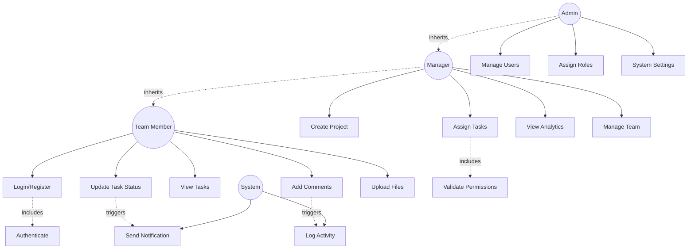

# Use Case Diagram

## Actors
- **Team Member**: Regular user who can create and manage their own tasks
- **Manager**: Can create projects, assign tasks to team members, and view team analytics
- **Admin**: Has full system access, manages users and system settings
- **System**: Automated processes like notifications and logging

## Use Cases

### Team Member Use Cases
1. Register and Login
2. View Assigned Tasks
3. Create Personal Tasks
4. Update Task Status
5. Add Comments to Tasks
6. Upload Attachments
7. View Dashboard
8. Search Tasks

### Manager Use Cases
1. All Team Member capabilities
2. Create Projects
3. Assign Tasks to Team Members
4. Reassign Tasks
5. View Team Analytics
6. Manage Project Members
7. Set Task Priorities
8. View Activity Logs

### Admin Use Cases
1. All Manager capabilities
2. Manage Users (Create, Update, Delete, Deactivate)
3. Assign Roles
4. View System Logs
5. Configure System Settings
6. Manage All Projects

### System Use Cases
1. Send Email Notifications
2. Log Activities
3. Validate Permissions
4. Generate Reports

## Diagram

## Use Case Descriptions

### Use Case 1: Login/Register
- **Actor**: Team Member, Manager, Admin
- **Description**: User registers a new account or logs into existing account
- **Preconditions**: None for registration; Valid credentials for login
- **Postconditions**: User is authenticated and receives JWT token
- **Main Flow**: 
  1. User enters email and password
  2. System validates credentials
  3. System generates JWT token
  4. User is redirected to dashboard

### Use Case 2: Create Project
- **Actor**: Manager, Admin
- **Description**: Manager creates a new project and adds team members
- **Preconditions**: User must be logged in with Manager or Admin role
- **Postconditions**: New project is created and team members are notified
- **Main Flow**: 
  1. Manager clicks "Create Project"
  2. Manager enters project details (name, description, deadline)
  3. Manager selects team members
  4. System validates permissions
  5. System creates project and sends notifications

### Use Case 3: Assign Task
- **Actor**: Manager, Admin
- **Description**: Manager assigns a task to a team member
- **Preconditions**: Project exists, user has Manager role, assignee is project member
- **Postconditions**: Task is assigned and assignee receives notification
- **Main Flow**: 
  1. Manager creates task with details
  2. Manager selects assignee
  3. System validates permissions
  4. System creates task assignment
  5. System logs activity
  6. System sends email notification to assignee

### Use Case 4: Update Task Status
- **Actor**: Team Member, Manager, Admin
- **Description**: User updates the status of a task (To Do, In Progress, Done)
- **Preconditions**: User is assigned to task or has Manager/Admin role
- **Postconditions**: Task status is updated, activity is logged, notifications sent
- **Main Flow**: 
  1. User opens task details
  2. User changes status dropdown
  3. System validates permissions
  4. System updates task status
  5. System logs activity
  6. System notifies project manager

### Use Case 5: Add Comment
- **Actor**: Team Member, Manager, Admin
- **Description**: User adds a comment to a task for collaboration
- **Preconditions**: User has access to the project
- **Postconditions**: Comment is saved and mentioned users are notified
- **Main Flow**: 
  1. User opens task
  2. User types comment (can mention other users with @)
  3. User submits comment
  4. System saves comment with timestamp
  5. System notifies mentioned users

### Use Case 6: Manage Users
- **Actor**: Admin
- **Description**: Admin creates, updates, or deactivates user accounts
- **Preconditions**: User must have Admin role
- **Postconditions**: User account is modified in the system
- **Main Flow**: 
  1. Admin navigates to user management
  2. Admin selects action (create/update/deactivate)
  3. Admin enters/modifies user details
  4. System validates data
  5. System updates database
  6. System logs admin action
